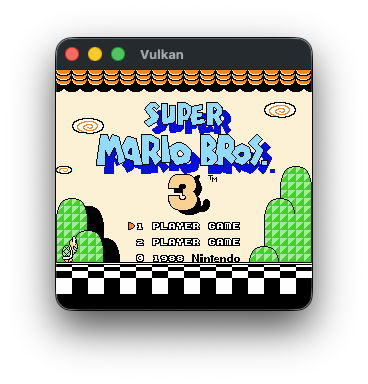
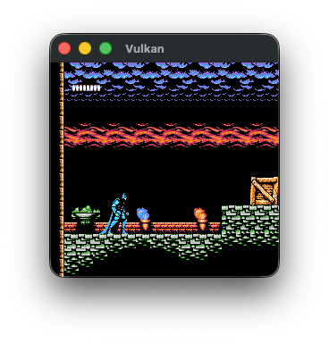

# Vulkan PPU

Implemention of retro picture processing units (just NES for now) implemented as Vulkan compute pipelines.

I wrote a compute shader that approximates how the NES PPU would render a single scanline and use this to render real NES memory dumps from an emulator.

To support advanced functionality like changing the Y offset partway through a frame (as is done in the title screen of Super Mario Bros 3), I supported composing memory operations that could be performed either before a frame's work begins (for regular animations that occur during 'V-Blank') or at the 'H-Blank' of a given scanline.

This uses my barebones [Vulkan Wrapper](https://github.com/zach-youssef/vulkan_testing/tree/main) that is mostly some RAII wrappers around Vulkan objects along with a basic framework for constructing render graphs.

# Screnshots

